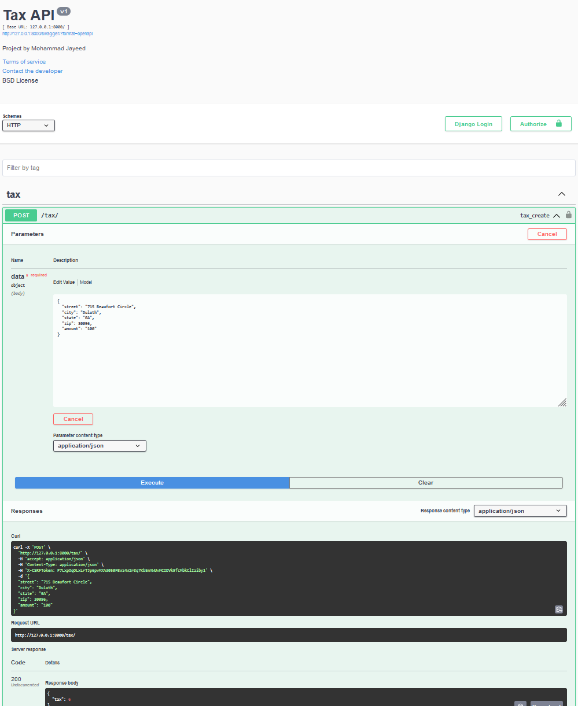

## Step 1 - Repository
- Clone the following [repository](https://github.com/mohammadjayeed/taxcalc.git),
```bash
  git clone  https://github.com/mohammadjayeed/taxcalc.git
```
## Step 2 - Virtual Environment
- Make a virtual environment with the following command
```bash
  python -m venv venv
```
-  Activate the virtual environment with the command
```bash
  venv/scripts/activate  or  source venv/bin/activate (for linux)
```
## Step 3 - Dependencies
- Install dependencies
```bash
  pip install -r requirement.txt
```
## Step 4 - Start App
- Start the application by typing the following command
```bash
  python manage.py runserver
```
## Step 4 - Start App
- Try the API using swagger
```bash
  127.0.0.1:8000/swagger
```
### Project Sample
